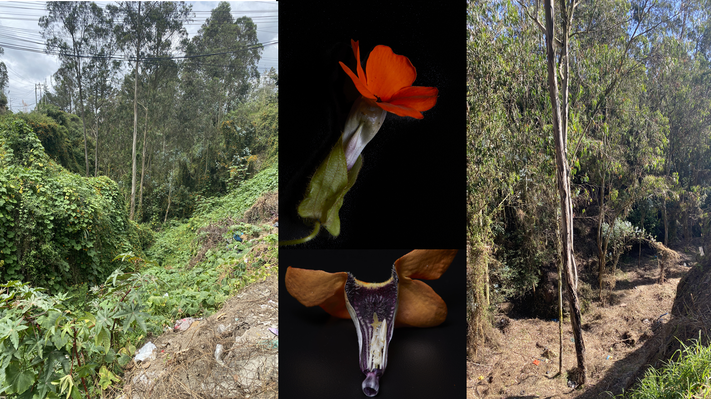
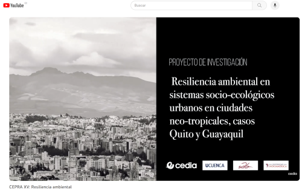
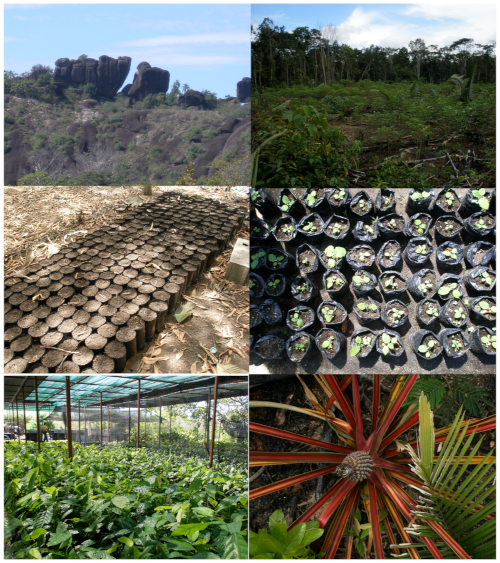

2023-2024: Spatial Distribution and Participatory Management Strategies for Controlling Thunbergia alata and Conserving Ecosystem Goods and Services in Andean Landscapes: The Case of the Metropolitan District of Quito
Abstract
Rol: Principal investigator

Thunbergia alata, an invasive exotic plant, poses a significant threat to natural habitats, causing detrimental effects on biodiversity and ecosystem stability. This project focuses on mitigating the increasing presence of Thunbergia alata in the Andean landscapes within the Metropolitan District of Quito. The methodology consists of three essential components: Firstly, an extensive spatial modeling approach is employed to assess the distribution and expansion of Thunbergia alata. This analysis incorporates topographic variables, land cover data, multispectral imagery, field surveys, and data from citizen science initiatives. By mapping the extent of the invasion, this component provides valuable insights into the most affected areas and those at higher risk. Secondly, a targeted communication and environmental education program is designed to engage local leaders and decision-makers. The primary aim is to enhance awareness of the ecological impacts of Thunbergia alata invasion and to foster active commitment to its control. Effective community and governmental involvement is vital for the success of invasive species management strategies. Lastly, the project implements experimental strategies and monitoring programs on a smaller scale, concentrating on eradicating Thunbergia alata in ecologically sensitive zones such as the parishes of Conocoto and Nayón. These localized efforts are focused on preventing further spread and restoring native ecosystems. In conclusion, this project seeks to establish a robust scientific foundation for identifying priority intervention areas and gaining a deeper understanding of Thunbergia alata impact on biodiversity. Through this research, effective management strategies can be developed, contributing to the eradication of this invasive species and the preservation of crucial ecosystem services. Ultimately, this project represents a crucial step towards safeguarding the unique and fragile Andean landscapes within the Metropolitan District of Quito from the invasive threat posed by Thunbergia alata.

Thunbergia alata, una planta exótica invasora, representa una amenaza significativa para los hábitats naturales, causando efectos perjudiciales sobre la biodiversidad y la estabilidad de los ecosistemas. Este proyecto se centra en mitigar la creciente presencia de Thunbergia alata en los paisajes andinos del Distrito Metropolitano de Quito. La metodología consta de tres componentes esenciales: En primer lugar, se emplea un amplio enfoque de modelado espacial para evaluar la distribución y expansión de Thunbergia alata. Este análisis incorpora variables topográficas, datos sobre la ocupación del suelo, imágenes multiespectrales, estudios de campo y datos procedentes de iniciativas de ciencia ciudadana. Al cartografiar la extensión de la invasión, este componente proporciona información valiosa sobre las zonas más afectadas y las de mayor riesgo. En segundo lugar, se ha diseñado un programa específico de comunicación y educación ambiental para implicar a los líderes y responsables locales. El objetivo principal es aumentar la concienciación sobre las repercusiones ecológicas de la invasión de Thunbergia alata y fomentar un compromiso activo para su control. La implicación efectiva de la comunidad y los gobiernos es vital para el éxito de las estrategias de gestión de especies invasoras. Por último, el proyecto implementa estrategias experimentales y programas de monitoreo a menor escala, concentrándose en la erradicación de Thunbergia alata en zonas ecológicamente sensibles como las parroquias de Conocoto y Nayón. Estos esfuerzos localizados están enfocados en prevenir una mayor propagación y restaurar los ecosistemas nativos. En conclusión, este proyecto busca establecer una base científica robusta para identificar áreas prioritarias de intervención y obtener una comprensión más profunda del impacto de Thunbergia alata en la biodiversidad. Gracias a esta investigación, se podrán desarrollar estrategias de gestión eficaces que contribuyan a la erradicación de esta especie invasora y a la preservación de servicios ecosistémicos cruciales. En última instancia, este proyecto representa un paso crucial para salvaguardar los paisajes andinos únicos y frágiles del Distrito Metropolitano de Quito de la amenaza invasora que supone Thunbergia alata.

Enero-Diciembre-2020.Environmental resilience in cities. Quito and Guayaquil cases [https://cedia.edu.ec/resiliencia-ambiental-en-sistemas-socio-ecologicos-urbanos-de-ciudades-neo-tropicales-casos-quito-y-guayaquil/](https://cedia.edu.ec/resiliencia-ambiental-en-sistemas-socio-ecologicos-urbanos-de-ciudades-neo-tropicales-casos-quito-y-guayaquil/)

Rol: Principal investigator

      
Global urbanization and rapid urban population growth are two dominant demographic trends in this century. Both are the products of socio-ecological relationships posing as true challenges to sustainability, due to environmental justice and the well-being of citizens in urban environments. Environmental monitoring methods, including spatial approach, use of sensors and remote sensing, integrate the
understanding of environmental variations from a socio-ecological perspective. However, they are scarcely used in developing countries. The application of these methods, their results, analysis and
decision-making could play a decisive role in urban planning. Therefore, this project proposes to broaden the knowledge on environmental quality in urban areas of Ecuador, considering a framework of complex
adaptive systems integrating different socio-ecological dimensions from a space-time approach and establishing a sustainability criterion for urban planning of neo-tropical cities. For this we propose the
spatial-temporal analysis of some environmental indicators in the Andean and coastal cities. In the spatial field, to understand the environmental and land cover variations we resort to the use of remote sensors
(SPOT, SENTINEL). We also use databases resulting from the monitoring of more than ten years of pollution and meteorological indicators. In the temporal sphere we analyze the before and after two
random events, states of exception due to: Global Sanitary Emergency due to COVID-19 and the National Protests of October 2019. This information will be analyzed through statistical, geo-statistical and artificial
intelligence. Our results will provide information on the specific socio-ecological relationships that caused environmental variations, allowing us to identify limits in the resilience capacity of urban environmental
systems. This information is decisive for city planning decisions in the framework of environmental justice and well-being. Finally, this information is integrated into a mobile application that allows citizens to
interact with the results of this project. This innovative project promotes a scientific community dedicated to environmental monitoring focused on the delivery of information both for decision-making and for the
generation of early warnings of the environmental variations that compromise the system, in addition to the well-being and environmental justice of the citizens.

Resiliencia ambiental en sistemas socio-ecológicos urbanos de ciudades neo-tropicales, casos Quito y Guayaquil. El proceso de urbanización global y el crecimiento de la población urbana son dos tendencias demográficas dominantes en el siglo XXI. Ambas son producto de relaciones socio-ecológicas y se presentan como verdaderos desafíos de la sostenibilidad. Los ambientes urbanos deben garantizar la justicia ambiental y el bienestar de los ciudadanos. Métodos de monitoreo ambiental que incluya desde un enfoque espacial el uso de sensores y técnicas de teledetección, e integren desde una perspectiva socio-ecológica el entendimiento de las variaciones
ambientales son muy poco usados en países en vías de desarrollo. La aplicación de estos métodos, sus resultados, análisis y toma de decisiones a partir de ellos, podría ser determinante en la planificación
urbana. Este proyecto plantea ampliar el conocimiento referente a la calidad ambiental urbana de las ciudades del Ecuador, considerando un marco de sistemas adaptativos complejos que integre distintas dimensiones
socio-ecológicas desde en enfoque espacio temporal y establezca criterios de sostenibilidad que incluya estas dimensiones generando una caja de herramientas que pueda ser aplicada en las dinámicas de
planificación urbana de ciudades neo-tropicales. Para esto planteamos el análisis espacio-temporal de algunos indicadores ambientales en ciudades
andinas y litorales. En el ámbito espacial, para entender las variaciones ambientales y de la cobertura de la tierra recurrimos al uso de sensores remotos (SPOT, SENTINEL). Usamos igualmente bases de datos
resultados del monitoreo de más de diez años de indicadores de contaminación y meteorológicos. En el ámbito temporal analizamos el antes y después de dos eventos aleatorios, estados de excepción a causa
de: Emergencia Sanitaria Global y las Protestas de transportistas sucedidas en Quito en Octubre 2020. Esta información se analizará a través de métodos estadísticos, geo-estadísticos y de inteligencia
artificial. Nuestros resultados proporcionan información sobre las relaciones socio-ecológicas puntuales que provocaron las variaciones ambientales permitiendo identificar límites en la capacidad de resiliencia de
los sistemas ambientales urbanos. Esta información resulta determinante para las decisiones de planificación de la ciudad en el marco de la justicia ambiental y el bienestar. Finalmente esta información
se integrará en una aplicación móvil que permitirá interactuar al ciudadano con los resultados de este proyecto. Mostrándose como un piloto para generar una comunidad científica de monitoreo ambiental
enfocada en la entrega de información tanto para la toma de decisiones como para la generación de alertas tempranas, de las variaciones ambientales que comprometen al sistema, además de al bienestar y la justicia ambiental de los ciudadanos.

2004-2009. Development of sustainable agroforestry systems based on indigenous and maroon knowledge in the Guyana shield region (Guyagrofor Project: [https://cordis.europa.eu/project/id/510935](https://cordis.europa.eu/project/id/510935).

Rol: Researcher of the Multiple Management of Forest Ecosystems Group, Universidad de los Andes Venezuela.

"In the rainforests of Suriname, Brazil and Venezuela, Indigenous and Maroon communities are facing increased outside pressures on their communal lands. These communities harbour hundreds of years of experience in managing agricultural production in the com plex rainforest ecosystem and exploiting its resources of Timber and Non Timber Forest Products (NTFP's) in an extensive way. Unfortunately, their capacities as managers of the forest resource base have yet insufficiently been exploited for the benefit of the national economy. Since over-exploitation would endanger their livelihood, exploitation of the forest resource base for agriculture, timber, medicinal plants, fruits, etc. has been an integral part of their livelihood strategies aimed at long-term surv ival rather than short-term profit. Careful exploitation of traditional knowledge on the multiple uses of NTFP's (e.g. fruits, medicinal plants) could open up new sources of income generating activities that could be of profit to both the micro economy of Indigenous and Maroon communities as well as to national economy through increased market interaction. This proposal aims to develop new strategies for the production of environmentally safe and economically viable cash crops, timber and non-timber forest products based on Indigenous and Maroon livelihood strategies. Emphasis will be put on understanding Indigenous and Maroon traditional practices and finding ways to incorporate their knowledge of the rainforest ecosystem into sustainable agro-forestry systems: integration of Indigenous and Maroon knowledge with formal science rather than replacement of one by the other. Organisational capacities of the communities involved and institutional capacities of local institutions will be promoted through the formu lation and implementation of specific support actions (Guyagrofor, https://cordis.europa.eu/project/id/510935)."

En las selvas tropicales de Surinam, Brasil y Venezuela, las comunidades indígenas y cimarronas se enfrentan a una creciente presión externa sobre sus tierras comunales. Estas comunidades atesoran cientos de años de experiencia en la gestión de la producción agrícola en el complejo ecosistema de la selva tropical y en la explotación extensiva de sus recursos de madera y productos forestales no madereros (PFNM). Por desgracia, sus capacidades como gestores de la base de recursos forestales aún no se han explotado lo suficiente en beneficio de la economía nacional. Dado que la sobreexplotación pondría en peligro sus medios de subsistencia, la explotación de los recursos forestales para la agricultura, la madera, las plantas medicinales, las frutas, etc. ha sido parte integrante de sus estrategias de subsistencia orientadas a la supervivencia a largo plazo más que al beneficio a corto plazo. Una explotación cuidadosa de los conocimientos tradicionales sobre los múltiples usos de los PFNM (por ejemplo, frutas, plantas medicinales) podría abrir nuevas fuentes de actividades generadoras de ingresos que podrían ser beneficiosas tanto para la microeconomía de las comunidades indígenas y cimarronas como para la economía nacional a través de una mayor interacción con el mercado. Esta propuesta pretende desarrollar nuevas estrategias para la producción de cultivos comerciales, madera y productos forestales no madereros seguros para el medio ambiente y económicamente viables, basadas en las estrategias de subsistencia indígenas y cimarronas. Se hará hincapié en la comprensión de las prácticas tradicionales indígenas y cimarronas y en la búsqueda de formas de incorporar sus conocimientos sobre el ecosistema de la selva tropical a los sistemas agroforestales sostenibles: integración de los conocimientos indígenas y cimarronas con la ciencia formal en lugar de sustitución de unos por otros. Se fomentarán las capacidades organizativas de las comunidades implicadas y las capacidades institucionales de las instituciones locales mediante la formulación y aplicación de acciones de apoyo específicas (Guyagrofor, https://cordis.europa.eu/project/id/510935)."

### Contact me

[santiagobonillab@hotmail.es](mailto:santiagobonillab@hotmail.es)
